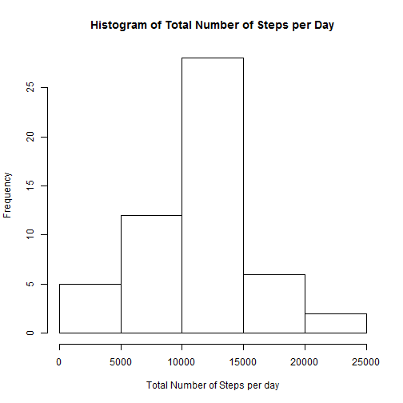
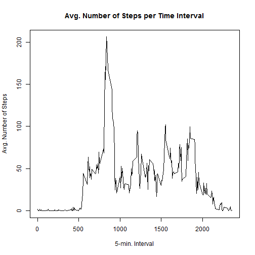
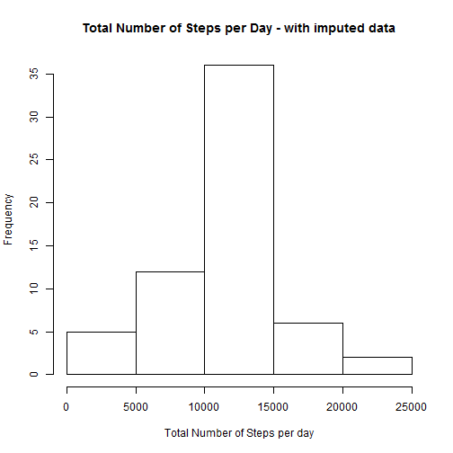
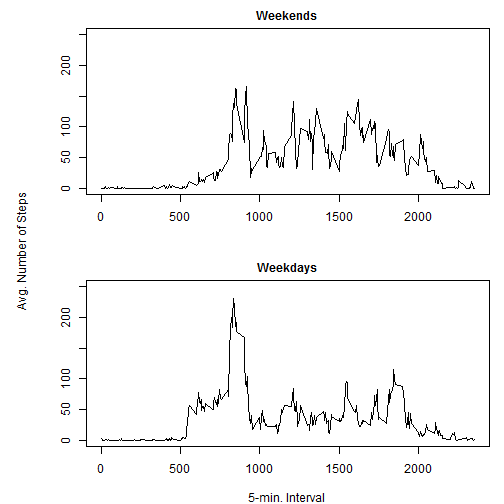

## Reproducible Research - Peer Assessment 1

### 1. Loading and preprocessing the data
The data is loaded and the 'date'-column is converted to the Date Class.


```r
activityData <- read.csv("activity.csv",header=TRUE,
                         na.strings="NA",stringsAsFactors=FALSE)

activityData$date <- as.Date(activityData$date,format="%Y-%m-%d")
```

### 2. Total number of steps taken per day

The data is aggregated (summed) to calculate the total number of steps taken each day and these figures are summarized in a histogram.


```r
stepsByDay <- aggregate(steps ~ date,data=activityData,sum)

hist(stepsByDay$steps,
     xlab="Total Number of Steps per day",
     main="Histogram of Total Number of Steps per Day")
```

 

Additionally the mean and median total numbers of steps are calculated...


```r
meanStepsByDay <- mean(stepsByDay$steps,na.rm=TRUE)
medianStepsByDay <- median(stepsByDay$steps,na.rm=TRUE)
```

... resulting in:  
*Mean Total Number of Steps per Day* = 10766.2  
*Median Total Number of Steps per Day* = 10765.0

### 3. Average daily activity pattern

Next the data is averaged by interval across all days. The result is reported in a time series.


```r
stepsByInt <- aggregate(steps ~ interval,data=activityData,mean)

with(stepsByInt,plot(interval,steps,
                     xlab = "5-min. Interval",
                     ylab = "Avg. Number of Steps",
                     main = "Avg. Number of Steps per Time Interval",
                     type = "l"))
```

 

And subsequently the interval with the maximum average number of steps is determined:


```r
stepsByInt[which.max(stepsByInt$steps),]$interval
```

```
## [1] 835
```

### 4. Missing values

First has to be determined where the missing values are located.


```r
rowsWithMissings <- sum(!complete.cases(activityData))
intervalsWithMissings <- sum(is.na(activityData$interval))
datesWithMissings <- sum(is.na(activityData$date))
stepsWithMissings <- sum(is.na(activityData$steps))
```

So there are 2304 rows with (some) values missing. Those missings are distributed over the individual columns as follows:  
*interval:* 0 missings  
*date:* 0 missings  
*steps:* 2304 missings  

So only the 'steps'-column contains missings. Those missings could be filled by the overall column mean. However, there might be a more sophisticated strategy, for example by imputing the mean for that day, or the mean for that 5-minute interval. These strategies will only work if a mean, for that day or interval, can be calculated. In other words: means to impute can only be calculated in case there are no dates or intervals with **all** values missing.


```r
completesByData <- sapply(split(activityData$steps,activityData$date),
                          function(x) sum(!is.na(x)))
emptyDays <- length(which(completesByData==0))

completesByInt <- sapply(split(activityData$steps,activityData$interval),
                         function(x) sum(!is.na(x)))
emptyInts <- length(which(completesByInt==0))
```

It turns out that there are 8 dates with no valid data and 0 intervals with no valid data. This rules out the mean by date but leaves the mean by interval as a candidate for imputation. This is now applied to the data.


```r
missings <- subset(activityData[is.na(activityData$steps),],select=-c(steps))
imputation <- merge(missings,stepsByInt)
imputedData <- rbind(activityData[!is.na(activityData$steps),],imputation)
imputedData <- imputedData[order(imputedData$date,imputedData$interval),]
```

Now again a histogram is generated and the new mean and median are calculated.


```r
stepsByDayImp <- aggregate(steps ~ date,data=imputedData,sum)

hist(stepsByDayImp$steps,
     xlab="Total Number of Steps per day",
     main="Total Number of Steps per Day - with imputed data")
```

 

```r
meanStepsByDayImp <- mean(stepsByDayImp$steps,na.rm=TRUE)
medianStepsByDayImp <- median(stepsByDayImp$steps,na.rm=TRUE)
```

*Mean Total Number of Steps per Day* = 10766.2  
*Median Total Number of Steps per Day* = 10766.2  

So imputation results in the same mean and a slightly higher median.

### 5. Differences in activity patterns between weekdays and weekends

A new factor variable is created to distinguish between "weekdays" and "weekends".


```r
imputedData$weekday <- ifelse(format(imputedData$date,"%w") %in% 
                              c("0","6"),"weekend","weekday")
imputedData$weekday <- factor(imputedData$weekday)
```

Now a plot is created to compare the average number of steps across all days, split according to "weekday" and "weekend". 


```r
stepsByIntWd <- aggregate(steps ~ weekday+interval,data=imputedData,mean)

par(mfrow=c(2,1),mar=c(4,4,2,1) ,oma=c(0,2,0,0),cex.main=1)

with(subset(stepsByIntWd,weekday=="weekend"),
     plot(interval,steps,
          xlab = "", ylab = "", ylim = c(0,250),
          main = "Weekends",
          type = "l"))

with(subset(stepsByIntWd,weekday=="weekday"),
     plot(interval,steps,
          xlab = "5-min. Interval", ylab="", ylim = c(0,250),
          main = "Weekdays",
          type = "l"))

mtext("Avg. Number of Steps",side=2,outer=TRUE)
```

 
